# 有点东西

## 是什么

一个类似苹果小组件的 Web 版的小组件库，实质上就是一个站点。

## 特性

- Portable：用户数据均存本地，没有后台，没有中间商赚差价
- Pure：页面干净无广告
- Personalized：定制化、个性化程度高，一切均是组件，可自由选择组合排列

是的，总结起来，就是一个 3P 产品

## 预览

## 组件库

### 搜索引擎小组件

目前支持百度、谷歌、必应三个搜索引擎

### 导航小组件

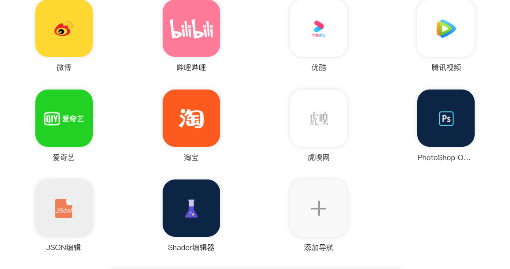

实质就是网址收集小工具，预置了一些常用的，还可以自定义添加

### 新冠疫情概览小组件

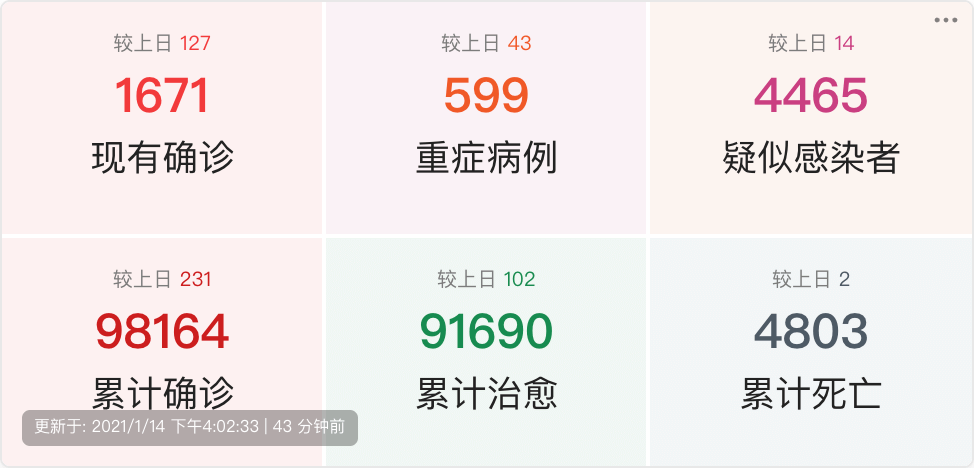
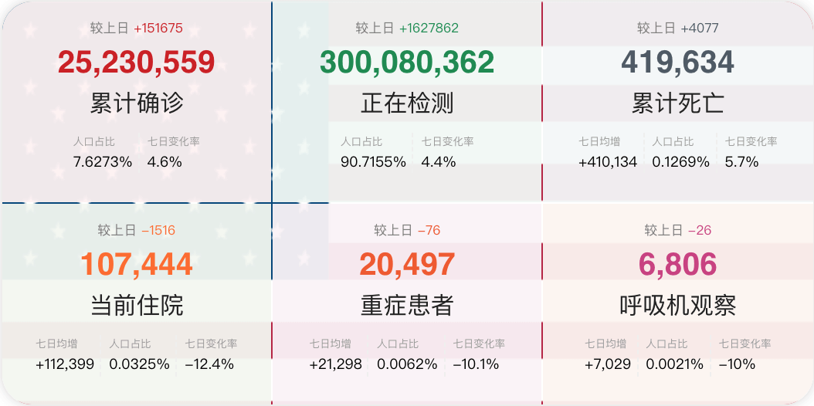

快速查看国内&美国最新新冠疫情发展数据

### 国际时钟

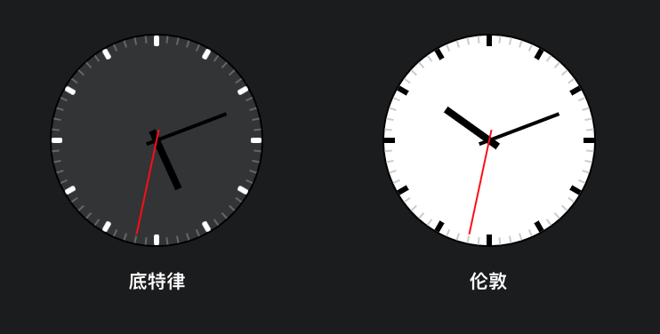

### 天气小组件

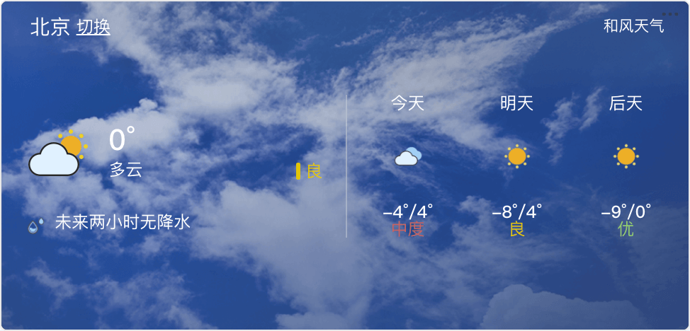

### Github 个人仓库列表

### 科学计算器

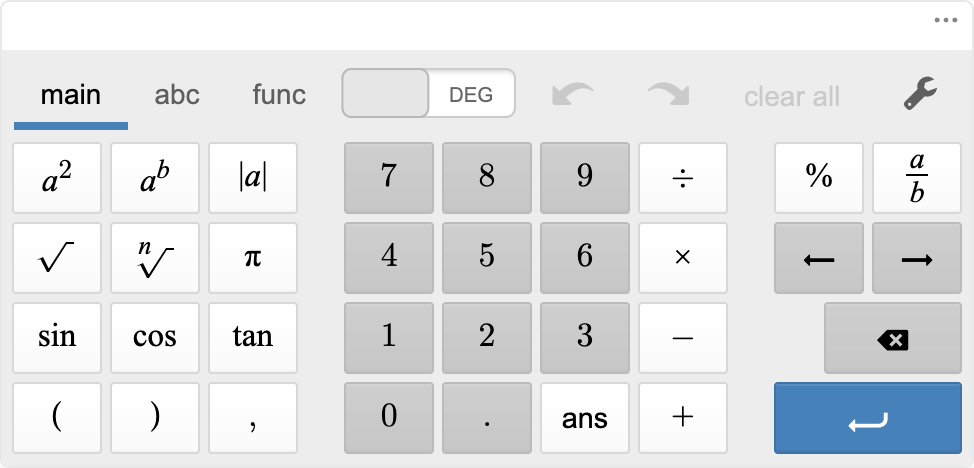

### 热搜类小组件

#### 微博热搜

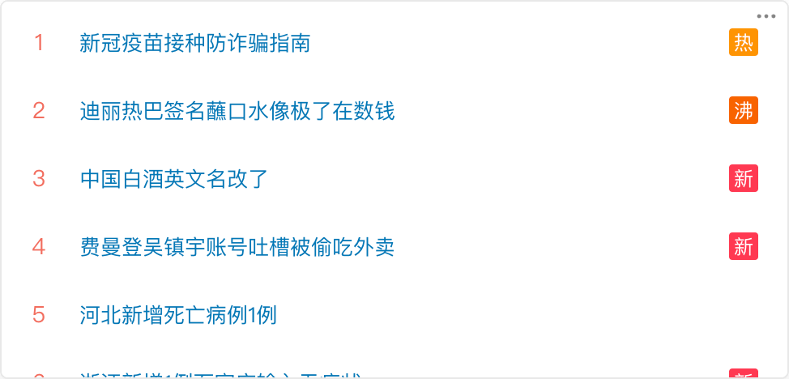

#### 公众号热文

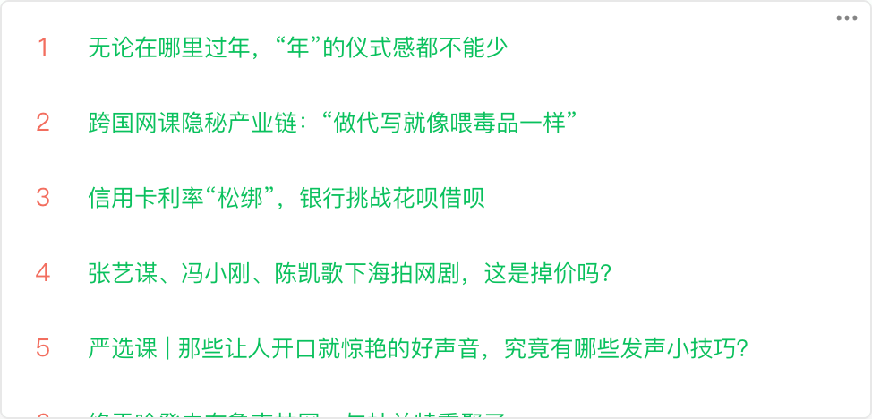

#### 知乎热搜

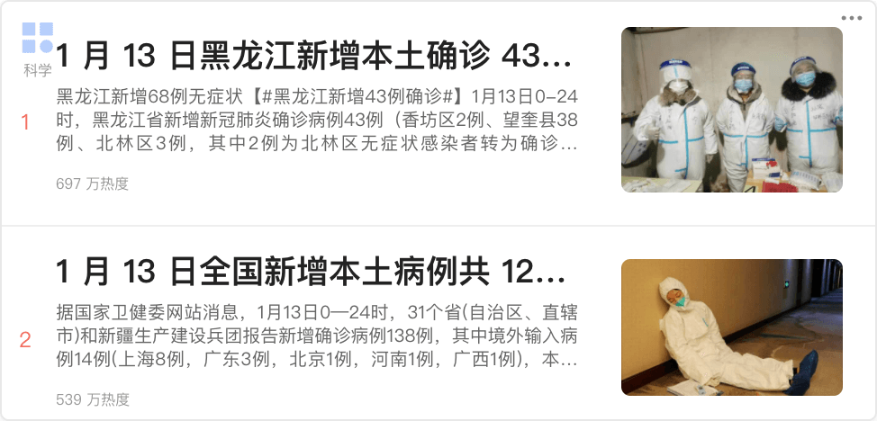

#### 豆瓣热门话题

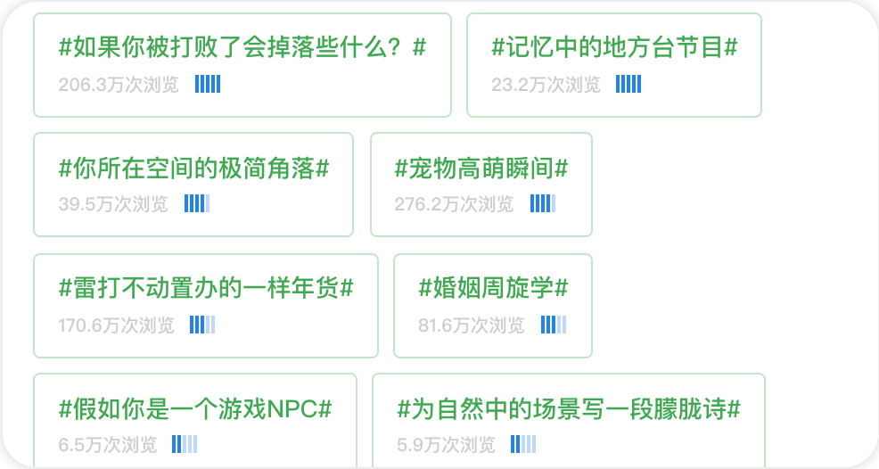

#### GitHub 流行榜

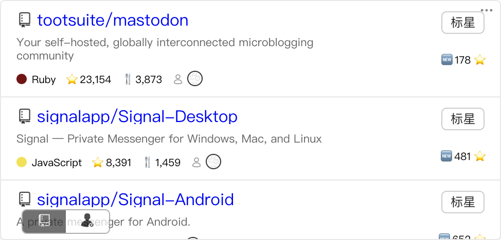

### 每日系列

#### 每日诗词

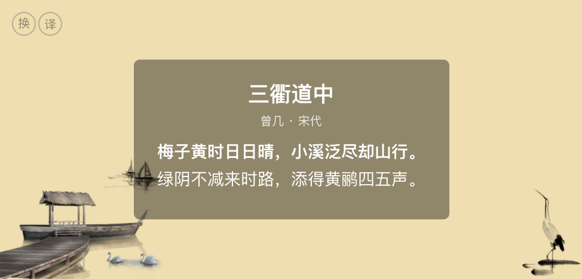

#### 一言

每天一句话

#### 必应壁纸

通过授权，列出个人的仓库列表

## 迭代计划

- 浏览器插件化：赋能更多的可能性
- 个人中心-账号体系
- 数据导出与导入
- 小组件开源方案
- 自研小组件
